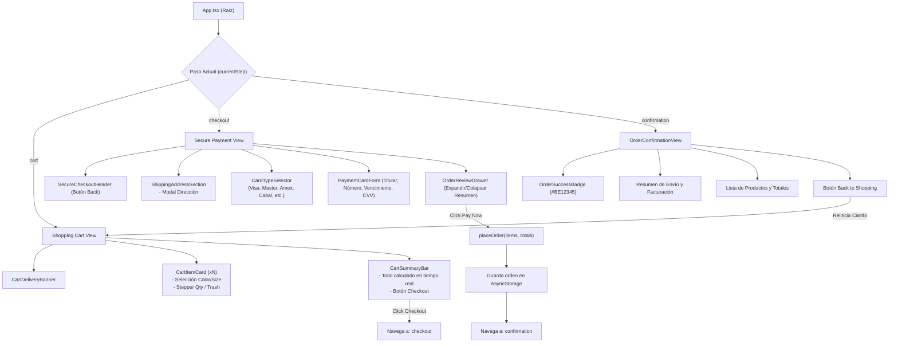

# 🏛️ Arquitectura del Sistema - TP2: Flujo Checkout Tienda

Este documento describe la estructura arquitectónica, las responsabilidades por módulo y el flujo de datos del **Trabajo Práctico N° 2 (Flujo de Checkout de Tienda Online)**, desarrollado en **React Native con Expo SDK 54** y TypeScript en modo estricto.

---

## 1. 📂 Árbol Completo de Carpetas del Proyecto

```text
Tp_2/
├── assets/                                 # Recursos multimedia, logos e iconografía
│   ├── products/                           # Fotografías de los productos en catálogo
│   │   ├── nike_court_lite_2.png           # Calzado NikeCourt Lite 2
│   │   └── wilson_hammer_5_3.png           # Raqueta de tenis Wilson Hammer 5.3
│   ├── icon.png                            # Ícono principal de la aplicación móvil
│   ├── favicon.png                         # Ícono para ejecuciones web
│   ├── android-icon-foreground.png         # Ícono adaptativo Android (capa frontal)
│   ├── android-icon-background.png         # Ícono adaptativo Android (capa de fondo)
│   └── android-icon-monochrome.png         # Ícono adaptativo Android monocromático
├── src/                                    # Código fuente principal de la aplicación
│   ├── components/                         # Componentes visuales organizados por dominio
│   │   ├── common/                         # Componentes reutilizables transversales
│   │   │   ├── CustomCheckbox.tsx          # Checkbox personalizado accesible
│   │   │   └── OptionSelectorModal.tsx     # Selector modal para Color y Talle
│   │   ├── cart/                           # Módulo de Carrito de Compras (Shopping Cart)
│   │   │   ├── CartDeliveryBanner.tsx      # Banner superior de estimación de entrega
│   │   │   ├── CartItemCard.tsx            # Tarjeta de producto con selectores y cantidad
│   │   │   ├── CartSummaryBar.tsx          # Barra fija inferior con total y acción Checkout
│   │   │   └── EmptyCartState.tsx          # Estado vacío con botón de restauración
│   │   ├── checkout/                       # Módulo de Pago Seguro (Secure Payment)
│   │   │   ├── SecureCheckoutHeader.tsx    # Cabecera con navegación y sello SSL
│   │   │   ├── ShippingAddressSection.tsx  # Tarjeta de dirección de envío y facturación
│   │   │   ├── CardTypeSelector.tsx        # Selector interactivo de marcas de tarjetas
│   │   │   ├── PaymentCardForm.tsx         # Formulario de tarjeta con máscara y CVV
│   │   │   └── OrderReviewDrawer.tsx       # Cajón desplegable con desglose de la orden
│   │   ├── address/                        # Módulo de Gestión de Direcciones
│   │   │   ├── AddressFormModal.tsx        # Modal de alta/edición de datos de entrega
│   │   │   └── AddressSelectionModal.tsx   # Modal de selección entre direcciones guardadas
│   │   └── confirmation/                   # Módulo de Confirmación de Pedido
│   │       ├── OrderSuccessBadge.tsx       # Insignia de confirmación y tilde de éxito
│   │       └── OrderConfirmationView.tsx   # Pantalla completa de orden confirmada
│   ├── hooks/                              # Custom hooks para encapsular lógica de estado
│   │   ├── useCartStorage.ts               # Estado del carrito, operaciones y persistencia
│   │   ├── useCheckoutState.ts             # Estado del flujo de pago, direcciones y orden
│   │   └── useThemeStyles.ts               # Tokens de diseño, paleta de colores y estilos
│   ├── types/                              # Definiciones e interfaces de TypeScript
│   │   ├── cart.types.ts                   # Modelos de producto, ítems de carrito y totales
│   │   ├── address.types.ts                # Modelos de dirección física y facturación
│   │   ├── payment.types.ts                # Tipos de tarjetas, marcas y datos de pago
│   │   └── checkout.types.ts               # Pasos de navegación y modelo de orden confirmada
│   └── utils/                              # Utilidades y capas de persistencia
│       ├── currencyFormatter.ts            # Formateo monetario exacto según Figma ($147,45)
│       └── cartStorage.ts                  # Métodos de lectura/escritura en AsyncStorage
├── App.tsx                                 # Contenedor raíz, orquestador de pasos y SafeArea
├── index.ts                                # Entrada oficial de arranque de Expo
├── app.json                                # Configuración de metadatos de Expo / Android / iOS
├── package.json                            # Dependencias y scripts del proyecto
├── tsconfig.json                           # Configuración del compilador TypeScript
├── COMO_EJECUTAR.md                        # Instrucciones paso a paso para ejecutar el TP
└── ARQUITECTURA.md                         # Documentación técnica y estructural del sistema
```

---

## 2. 🧩 Rol y Responsabilidad de Cada Carpeta

### `assets/` y `assets/products/`
Almacena los recursos estáticos binarios (imágenes, logos de aplicación e íconos adaptativos de Android). En `products/` se ubican las imágenes de los productos del catálogo (`nike_court_lite_2.png` y `wilson_hammer_5_3.png`), extraídas del diseño de Figma en alta definición.

### `src/components/common/`
Contiene micro-componentes de interfaz de usuario desacoplados y reutilizables en cualquier pantalla:
- `CustomCheckbox.tsx`: Control táctil de selección binaria con estilo idéntico al vector de Figma.
- `OptionSelectorModal.tsx`: Diálogo modal táctil para seleccionar atributos de producto (colores, talles) con tilde visual activa.

### `src/components/cart/`
Contiene la vista y subcomponentes de la pantalla **Shopping Cart**:
- `CartItemCard.tsx`: Ficha individual del producto. Presenta la imagen, títulos, precios (incluyendo precio anterior tachado si tiene descuento), selectores desplegables para **Color** y **Size** (Requerimiento de Negocio 1) y controles de incremento/decremento de **Qty**. Cuando la cantidad es 1, el control de decremento se transforma en un ícono de papelera roja para la eliminación de productos (Requerimiento de Negocio 2).
- `CartDeliveryBanner.tsx`: Franja superior que comunica el rango estimado de entrega ("Arrives by April 3 to April 9th").
- `CartSummaryBar.tsx`: Barra fija inferior que muestra el Total calculado en tiempo real y el botón de acción "Checkout".
- `EmptyCartState.tsx`: Estado de contingencia que se visualiza si el usuario elimina todos los productos, brindando un botón para recargar el carrito de demostración.

### `src/components/checkout/`
Contiene los componentes de la pantalla **Secure Payment**:
- `SecureCheckoutHeader.tsx`: Cabecera con botón de retroceso (`<`), título principal e insignia "SECURE SSL ENCRYPTION".
- `ShippingAddressSection.tsx`: Bloque que resume la dirección de entrega elegida, enlace rápido "Add / Edit" y casilla para igualar dirección de facturación.
- `CardTypeSelector.tsx`: Selector horizontal interactivo con píldoras de marca para **Visa**, **Mastercard**, **American Express**, **Cabal** y otras (Requerimiento de Negocio 3).
- `PaymentCardForm.tsx`: Campos de captura para titular, número de tarjeta con espaciado en bloques de 4 dígitos, mes/año de vencimiento, código de seguridad (CVV) con botón interactivo de ayuda informativa y casilla de guardado.
- `OrderReviewDrawer.tsx`: Cajón inferior expandible. En modo colapsado ofrece un carrusel horizontal con los ítems y botón "Pay Now". En modo expandido despliega la lista vertical completa de ítems y el desglose de Subtotal, Envío ($0,00) y Total.

### `src/components/address/`
Módulo para administrar las direcciones postales:
- `AddressFormModal.tsx`: Formulario modal completo que reproduce las pantallas 3 y 4 de Figma (destinatario, teléfono con código de país, email, dirección, ciudad, país y tipo de facturación Personal o Comercial).
- `AddressSelectionModal.tsx`: Selector de direcciones guardadas con radio buttons y botón para disparar la edición o alta de una nueva dirección (pantalla 7 de Figma).

### `src/components/confirmation/`
Módulo para la pantalla **Order Confirmation**:
- `OrderSuccessBadge.tsx`: Bloque de agradecimiento con tilde verde de éxito, número de orden único (ej: `#BE12345`), correo al cual se envió la factura y fecha/hora del pedido.
- `OrderConfirmationView.tsx`: Vista detallada que agrupa la dirección de entrega, dirección de cobro, lista de productos comprados, resumen de costos y el botón "Back to Shopping" para reiniciar el flujo.

### `src/hooks/`
Capa de lógica reactiva y desacoplamiento de estado:
- `useCartStorage.ts`: Orquesta la lista de ítems en el carrito, cálculo dinámico de totales, cambios de atributos (color, talle, cantidad), confirmación de eliminación de productos mediante `Alert` nativo y persistencia automática en `AsyncStorage`.
- `useCheckoutState.ts`: Orquesta los pasos de navegación (`cart` -> `checkout` -> `confirmation`), la selección de direcciones, el formulario de pago, la marca de tarjeta activa y el armado final del objeto de orden confirmada.
- `useThemeStyles.ts`: Centraliza la paleta cromática, espaciados y tokens visuales del proyecto.

### `src/types/`
Definiciones TypeScript estrictas (`.types.ts`) que modelan de forma inequívoca todas las entidades del dominio de negocio (carritos, pagos, direcciones y órdenes).

### `src/utils/`
Funciones utilitarias puras y controladores de bajo nivel:
- `currencyFormatter.ts`: Funciones de formateo monetario con coma decimal europea conforme al diseño.
- `cartStorage.ts`: Funciones asíncronas para interactuar con `@react-native-async-storage/async-storage`.

---

## 3. 🔄 Flujo del Código y Ciclo de Vida



### 1. Inicialización (`index.ts` -> `App.tsx`)
1. `index.ts` ejecuta `registerRootComponent(App)`.
2. `App.tsx` monta el contenedor `SafeAreaView`, aplicando el ajuste de status bar para dispositivos Android (`RNStatusBar.currentHeight`).
3. Se inicializan los hooks `useCartStorage()` y `useCheckoutState()`.
4. `useCartStorage` lee de manera asíncrona los ítems guardados en `AsyncStorage`. Si no existen, inicializa los productos predeterminados de Figma (`NikeCourt Lite 2` y `Wilson Hammer 5.3`).

### 2. Flujo en Pantalla Shopping Cart
1. El usuario visualiza la lista de productos y el banner de envío.
2. Al tocar **Color** o **Size**, se despliega `OptionSelectorModal`, actualizando reactivamente el ítem seleccionado.
3. Al modificar **Qty** mediante los controles `+` / `-`, el subtotal y total se recalculan instantáneamente.
4. Si la cantidad es 1 y se presiona la papelera roja, el sistema emite una alerta nativa de confirmación antes de eliminar el ítem con animación (`LayoutAnimation`).

### 3. Flujo en Pantalla Secure Payment
1. Al pulsar **Checkout**, `App.tsx` cambia el estado `currentStep` a `'checkout'`.
2. El usuario puede cambiar entre marcas de tarjeta (**Visa**, **Mastercard**, **Amex**, **Cabal/Otras**) con respuesta visual inmediata en el formulario y en el ícono de la tarjeta.
3. Puede gestionar direcciones de entrega y facturación tocando **Add / Edit**, abriendo `AddressSelectionModal` o `AddressFormModal`.
4. La barra inferior permite abrir y cerrar el cajón `OrderReviewDrawer` para inspeccionar el desglose pormenorizado de la compra antes de pagar.

### 4. Confirmación y Persistencia de la Orden
1. Al tocar **Pay Now**, se ejecuta `placeOrder(...)`.
2. Se genera un identificador de orden único (ej: `#BE12345`), fecha/hora actual y se persiste la orden en `AsyncStorage`.
3. Se transiciona a la pantalla de **Order Confirmation**, donde se exhibe el comprobante completo.
4. Al pulsar **Back to Shopping**, el carrito se restaura y el flujo regresa al inicio listo para una nueva compra.
